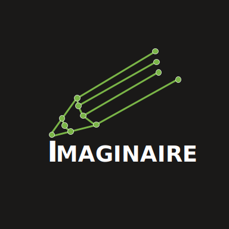

# Imaginaire
### [Docs](http://imaginaire.cc/docs) | [License](LICENSE.md) | [Installation](INSTALL.md) | [Model Zoo](MODELZOO.md)

Imaginaire is a [pytorch](https://pytorch.org/) library that contains
optimized implementation of several image and video synthesis methods developed at [NVIDIA](https://www.nvidia.com/en-us/).

## License

Imaginaire is released under [NVIDIA Software license](LICENSE.md).
For commercial use, please consult [researchinquiries@nvidia.com](researchinquiries@nvidia.com)

## What's inside?

We have a tutorial for each model. Click on the model name, and your browser should take you to the tutorial page for the project.

### Supervised Image-to-Image Translation

|Algorithm Name                               | Feature                                                                                                         | Publication                                                   |
|:--------------------------------------------|:----------------------------------------------------------------------------------------------------------------|--------------------------------------------------------------:|
|[pix2pixHD](projects/pix2pixhd/README.md)     | Learn a mapping that converts a semantic image to a high-resolution photorealistic image.                       |    [Wang et. al. CVPR 2018](https://arxiv.org/abs/1711.11585) |
|[SPADE](projects/spade/README.md)             | Improve pix2pixHD on handling diverse input labels and delivering better output quality.                        |    [Park et. al. CVPR 2019](https://arxiv.org/abs/1903.07291) |

### Unsupervised Image-to-Image Translation

|Algorithm Name                               | Feature                                                                                                         | Publication                                                   |
|:--------------------------------------------|:----------------------------------------------------------------------------------------------------------------|--------------------------------------------------------------:|
|[UNIT](projects/unit/README.md)               | Learn a one-to-one mapping between two visual domains.                                                          |    [Liu et. al. NeurIPS 2017](https://arxiv.org/abs/1703.00848) |
|[MUNIT](projects/munit/README.md)             | Learn a many-to-many mapping between two visual domains.                                                        |    [Huang et. al. ECCV 2018](https://arxiv.org/abs/1804.04732) |
|[FUNIT](projects/funit/README.md)             | Learn a style-guided image translation model that can generate translations in unseen domains.                  |    [Liu et. al. ICCV 2019](https://arxiv.org/abs/1905.01723) |
|[COCO-FUNIT](projects/coco_funit/README.md)   | Improve FUNIT with a content-conditioned style encoding scheme for style code computation.                      |    [Saito et. al. ECCV 2020](https://arxiv.org/abs/2007.07431) |

### Video-to-video Translation

|Algorithm Name                               | Feature                                                                                                         | Publication                                                   |
|:--------------------------------------------|:----------------------------------------------------------------------------------------------------------------|--------------------------------------------------------------:|
|[vid2vid](projects/vid2vid/README.md)         | Learn a mapping that converts a semantic video to a photorealistic video.                                       |    [Wang et. al. NeurIPS 2018](https://arxiv.org/abs/1808.06601) |
|[fs-vid2vid](projects/fs_vid2vid/README.md)   | Learn a subject-agnostic mapping that converts a semantic video and an example image to a photoreslitic video.  |    [Wang et. al. NeurIPS 2019](https://arxiv.org/abs/1808.06601) |
|[wc-vid2vid](projects/wc_vid2vid/README.md)   | Improve vid2vid on view consistency and long-term consistency.                                                  |    [Mallya et. al. ECCV 2020](https://arxiv.org/abs/2007.08509) |

