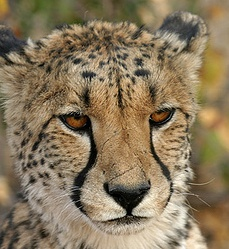
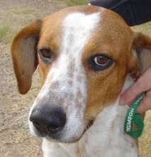
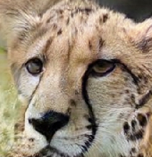
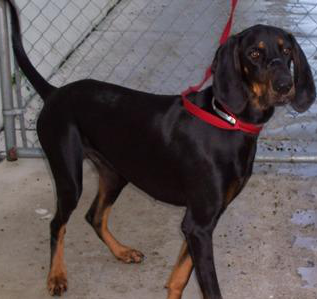
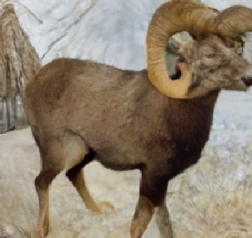

# COCO-FUNIT: Few-Shot Unsupervised Image Translation with a Content Conditioned Style Encoder

###
[Project](https://nvlabs.github.io/COCO-FUNIT/) |
[Paper](https://nvlabs.github.io/COCO-FUNIT/paper.pdf) |
[Video (3m)](https://youtu.be/X3EB8T8zdKw) | [Video (10m)](https://youtu.be/btnDfqcedrk) |
[Two Minute Papers Video](https://youtu.be/iKvlOviWs3E)


## Software Installation
For installation, please checkout [INSTALL.md](../../INSTALL.md).

## Hardware Requirement
We trained our model using an NVIDIA DGX1 with 8 V100 32GB GPUs. Training took about one week.

## Training

COCO-FUNIT prefers the following file arrangement.
```
${DATASET_ROOT_FOLDER}
└───images_content
    └───content_001.jpg
    └───content_002.jpg
    └───content_003.jpg
    ...
└───images_style
    └───style_001.jpg
    └───style_002.jpg
    ...
```

### Training data preparation
To ease the trouble, we provide a copy of the Animal Faces dataset for quick
experiments.
- Download the dataset and unzip the files. The raw images are saved in
projects/coco_funit/data/training
- Build the lmdbs
```bash
for f in train train_all val; do
python -m imaginaire.tools.build_lmdb \
--config  configs/projects/coco_funit/animal_faces/base64_bs8_class119.yaml \
--data_root projects/coco_funit/data/raw/training/animal_faces/${f} \
--output_root projects/coco_funit/data/lmdb/training/animal_faces/${f} \
--overwrite
done
```

### Training command

```bash
python -m torch.distributed.launch --nproc_per_node=8 train.py \
--config configs/projects/coco_funit/animal_faces/base64_bs8_class119.yaml \
--logdir logs/projects/coco_funit/animal_faces/base64_bs8_class119.yaml
```

## Inference
- Download test data by running
```bash
python scripts/download_test_data.py --model_name coco_funit
```

```bash
python inference.py --single_gpu \
--config configs/projects/coco_funit/animal_faces/base64_bs8_class149.yaml \
--output_dir projects/coco_funit/output/animal_faces
```

The results are stored in `projects/coco_funit/output/animal_faces`

Below we show the expected style--content-output images.


<table>
  <tr>
    <td>
        Style
    </td>
    <td>
        Content
    </td>
    <td>
        Translation
    </td>
  </tr>
  <tr>
    <td>
        
    </td>
    <td>
        
    </td>
    <td>
        
    </td>
  </tr>
</table>


#### Mammals dataset

```bash
python inference.py --single_gpu \
--config configs/projects/coco_funit/mammals/base64_bs8_class305.yaml \
--output_dir projects/coco_funit/output/mammals
```

The results are stored in `projects/coco_funit/output/mammals`

Below we show the expected style--content-outpt images.


<table>
  <tr>
    <td>
        Style
    </td>
    <td>
        Content
    </td>
    <td>
        Translation
    </td>
  </tr>
  <tr>
    <td>
        
    </td>
    <td>
        
    </td>
    <td>
        
    </td>
  </tr>
</table>


## Citation
If you use this code for your research, please cite our papers.

```
@inproceedings{saito2020cocofunit,
  title={COCO-FUNIT: Few-Shot Unsupervised Image Translation with a Content Conditioned Style Encoder},
  author={Kuni Saito and Kate Saenko and Ming-Yu Liu},
  booktitle={European Conference on Computer Vision (ECCV)}},
  year={2020}
}
```