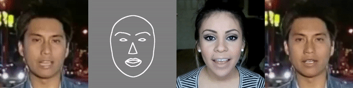

# Few-shot vid2vid: Few-Shot Video-to-Video Synthesis
Pytorch implementation for few-shot photorealistic video-to-video translation. It can be used for generating human motions from poses, synthesizing people talking from edge maps, or turning semantic label maps into photo-realistic videos.

###
[Project](https://nvlabs.github.io/few-shot-vid2vid/) |
[Video (2m)](https://youtu.be/8AZBuyEuDqc) |
[arXiv](https://arxiv.org/abs/1910.12713) |
[Previous Implementation](https://github.com/NVlabs/few-shot-vid2vid) |
[Two Minute Papers Video](https://youtu.be/4J0cpdR7qec)


## License

Imaginaire is released under [NVIDIA Software license](LICENSE.md).
For commercial use, please consult [researchinquiries@nvidia.com](researchinquiries@nvidia.com)

## Software Installation
For installation, please checkout [INSTALL.md](../../INSTALL.md).

## Hardware Requirement
We trained our models using an NVIDIA DGX1 with 8 V100 32GB GPUs. You can try to use fewer GPUs or reduce the batch size if it does not fit in your GPU memory, but training stability and image quality cannot be guaranteed.

## Datasets

### FaceForensics
We use the [FaceForensics](http://niessnerlab.org/projects/roessler2018faceforensics.html) dataset. We then use a landmark detection method (e.g. dlib) to estimate the face keypoints, and interpolate them to get face edges.

### YouTube Dancing
We use random dancing videos found on YouTube to crease a YouTube Dancing Dataset. We then apply DensePose / OpenPose to estimate the poses for each frame. The video URLs and code to preprocess them can be found [here](https://github.com/NVlabs/few-shot-vid2vid/tree/master/data/preprocess). Please note that the copyright of the dataset belongs to the original owners.


## Training
The following shows the example commands to train few-shot vid2vid on the face dataset. Training on the pose dataset is also similar.
- Download the dataset and put it in the format as following.
```
faceForensics
└───images
    └───seq0001
        └───000001.jpg
        └───000002.jpg
        ...
    └───seq0002
        └───000001.jpg
        └───000002.jpg
        ...
    ...
└───landmarks-dlib68
    └───seq0001
        └───000001.json
        └───000002.json
        ...
    └───seq0002
        └───000001.json
        └───000002.json
        ...
    ...
```

- Preprocess the data into LMDB format

```bash
python scripts/build_lmdb.py --config configs/projects/fs_vid2vid/faceForensics/ampO1.yaml --data_root [PATH_TO_DATA] --output_root datasets/faceForensics/lmdb/[train | val] --paired
```

- Train on 8 GPUs with AMPO1

```bash
python -m torch.distributed.launch --nproc_per_node=8 train.py \
--config configs/projects/fs_vid2vid/faceForensics/ampO1.yaml
```

## Inference
- Download some test data by running

```bash
python ./scripts/download_test_data.py --model_name fs_vid2vid
```

- Or arrange your own data into the same format as the training data described above.

- Translate facial landmarks to images
  - Inference command
    ```bash
    python inference.py --single_gpu --num_workers 0 \
    --config configs/projects/fs_vid2vid/faceForensics/ampO1.yaml \
    --output_dir projects/fs_vid2vid/output/faceForensics
    ```

Below we show an example output video:



## Citation
If you use this code for your research, please cite our papers.

```
@inproceedings{wang2019fewshotvid2vid,
   title     = {Few-shot Video-to-Video Synthesis},
   author    = {Ting-Chun Wang and Ming-Yu Liu and Andrew Tao 
                and Guilin Liu and Jan Kautz and Bryan Catanzaro},   
   booktitle = {Conference on Neural Information Processing Systems (NeurIPS)}},
   year      = {2019}
}
```