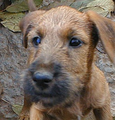
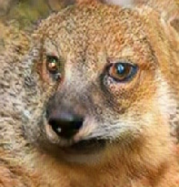

# FUNIT: Few-Shot Unsupervised Image-to-Image Translation

###
[Project](https://nvlabs.github.io/FUNIT/) |
[Paper](https://arxiv.org/abs/1905.01723) |
[Video (3m)](https://youtu.be/kgPAqsC8PLM) |
[Demo](https://www.nvidia.com/en-us/research/ai-playground/) |
[Previous Implementation](https://github.com/NVlabs/funit) |
[Two Minute Papers Video](https://youtu.be/SfvRhqsmU4o)


## License

Imaginaire is released under [NVIDIA Software license](LICENSE.md).
For commercial use, please consult [researchinquiries@nvidia.com](researchinquiries@nvidia.com)


## Software Installation
For installation, please checkout [INSTALL.md](../../INSTALL.md).

## Hardware Requirement
We trained our model using an NVIDIA DGX1 with 8 V100 32GB GPUs. Training took about one week.

## Training

FUNIT prefers the following data structure.
```
${TRAINING_DATASET_ROOT_FOLDER}
└───images_content
    └───content_001.jpg
    └───content_002.jpg
    └───content_003.jpg
    ...
└───images_style
    └───style_001.jpg
    └───style_002.jpg
    ...
```

### Training data preparation

- Download the dataset and untar the files.
```bash
python scripts/download_dataset.py --dataset animal_faces
```

- Build the lmdbs
```bash
for f in train train_all val; do
python scripts/build_lmdb.py \
--config  configs/projects/funit/animal_faces/base64_bs8_class119.yaml \
--data_root dataset/animal_faces_raw/${f} \
--output_root dataset/animal_faces/${f} \
--overwrite
done
```

### Training command

```bash
python -m torch.distributed.launch --nproc_per_node=8 train.py \
--config configs/projects/funit/animal_faces/base64_bs8_class119.yaml \
--logdir logs/projects/funit/animal_faces/base64_bs8_class119.yaml
```

## Inference

FUNIT prefers the following file arrangement for testing.
```
${TEST_DATASET_ROOT_FOLDER}
└───images_content
    └───0001.jpg
    └───0002.jpg
    └───0003.jpg
    ...
└───images_style
    └───0001.jpg
    └───0002.jpg
    └───0003.jpg
    ...
```
The style in style image 0001.jpg will be transferred to the content image
0001.jpg.imaginaire

- Download sample test data by running
```bash
python scripts/download_test_data.py --model_name funit
```

```bash
python inference.py --single_gpu \
--config configs/projects/funit/animal_faces/base64_bs8_class149.yaml \
--output_dir projects/funit/output/animal_faces
```

The results are stored in `projects/funit/output/animal_faces`

Below we show the expected style--content-output images.

<table>
  <tr>
    <td>
        Style
    </td>
    <td>
        Content
    </td>
    <td>
        Translation
    </td>
  </tr>
  <tr>
    <td>
        
    </td>
    <td>
        
    </td>
    <td>
        
    </td>
  </tr>
</table>

## Citation
If you use this code for your research, please cite our papers.

```
@inproceedings{liu2019few,
  title={Few-shot Unsueprvised Image-to-Image Translation},
  author={Ming-Yu Liu and Xun Huang and Arun Mallya and Tero Karras and Timo Aila and Jaakko Lehtinen and Jan Kautz.},
  booktitle={IEEE International Conference on Computer Vision (ICCV)}},
  year={2019}
}
```