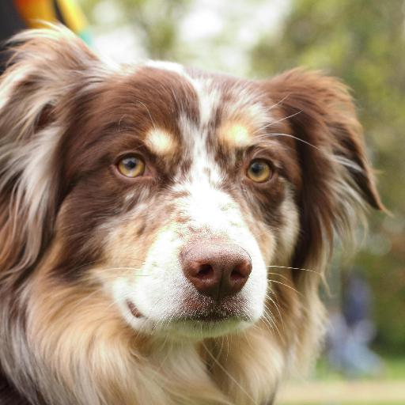
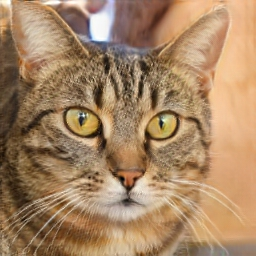

# MUNIT: Multimodal Unsupervised Image-to-Image Translation

###
[Paper](https://arxiv.org/abs/1804.04732) |
[Video Demo (1m)](https://youtu.be/ab64TWzWn40) |
[Previous Implementation](https://github.com/NVlabs/MUNIT)


This is an improved implementation of MUNIT. The main differences are:
- Use spectral normalization in the generator and the discriminator.
- Use the two-timescale update rule (TTUR) with the discriminator learning rate 0.0004 and the generator learning rate 0.0001.
- Use hinge loss instead of least square loss.
- Use a global residual discriminator instead of multi-resolution patch-wise discriminators for datasets that contain iconic objects and do not require pixel-wise correspondence (e.g., animal faces).

## License

Imaginaire is released under [NVIDIA Software license](LICENSE.md).
For commercial use, please consult [researchinquiries@nvidia.com](researchinquiries@nvidia.com)

## Software Installation
For installation, please checkout [INSTALL.md](../../INSTALL.md).

## Hardware Requirement
We trained our models using an NVIDIA DGX1 with 8 V100 32GB GPUs. You can try to use fewer GPUs or reduce the batch size if it does not fit in your GPU memory, but training stability and image quality cannot be guaranteed.

## Training

MUNIT prefers the following data structure.
```
${TRAINING_DATASET_ROOT_FOLDER}
└───images_a
    └───001.jpg
    └───002.jpg
    └───003.jpg
    ...
└───images_b
    └───001.jpg
    └───002.jpg
    ...
```

### Training data preparation

- Here we use dog and cat images in the animal face datasets (AFHQ). The dataset is available (https://github.com/clovaai/stargan-v2) under Creative Commons BY-NC 4.0 license by NAVER Corporation. Download and extract the data

```bash
python scripts/download_dataset.py --dataset afhq_dog2cat
```

- Preprocess the data into LMDB format

```bash
bash scripts/build_lmdb.sh munit afhq_dog2cat
```

### Training command

```bash
python -m torch.distributed.launch --nproc_per_node=8 train.py \
--config configs/projects/munit/afhq_dog2cat/ampO1.yaml
```

## Inference
- Download a small set of test examples (5 randomly sampled images from the test set)

```bash
python scripts/download_test_data.py --model_name munit
```

- Or arrange your own data into the following format.

```
projects/munit/test_data/afhq_dog2cat
└───images_a
    └───0001.jpg
    └───0002.jpg
    └───0003.jpg
    ...
└───images_b
    └───0001.jpg
    └───0002.jpg
    └───0003.jpg
    ...
```

- Translate images from dogs to cats
  - Inference command
    ```bash
    python -m torch.distributed.launch --nproc_per_node=1 inference.py \
    --config configs/projects/munit/afhq_dog2cat/ampO1.yaml \
    --output_dir projects/munit/output/afhq_dog2cat
    ```
    Outputs are saved in `projects/munit/output/afhq_dog2cat`:
    
    
  - To use the style from example cat images, change `random_style` in `configs/projects/munit/afhq_dog2cat/ampO1.yaml` to `False`. 
  - To translate images in the other direction (from cats to dogs), change `a2b` to `False`. 

## Citation
If you use this code for your research, please cite our paper.

```
@inproceedings{huang2018multimodal,
  title={Multimodal Unsupervised Image-to-image Translation},
  author={Huang, Xun and Liu, Ming-Yu and Belongie, Serge and Kautz, Jan},
  booktitle={European Conference on Computer Vision (ECCV)}},
  year={2018}
}
```
