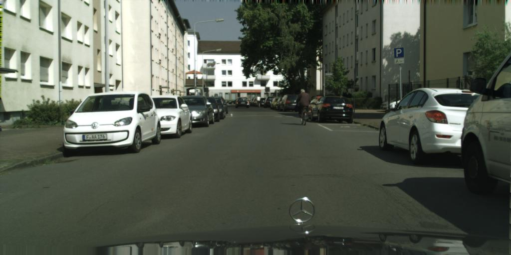
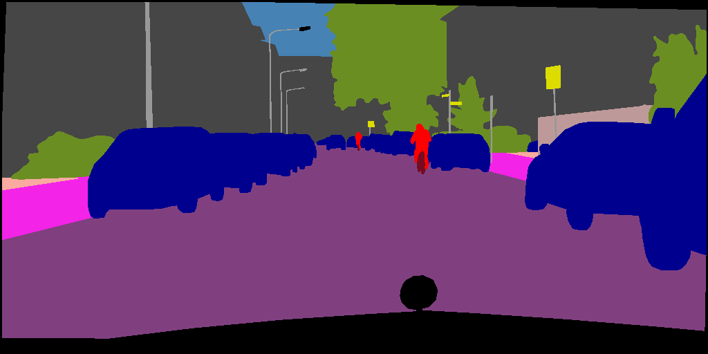
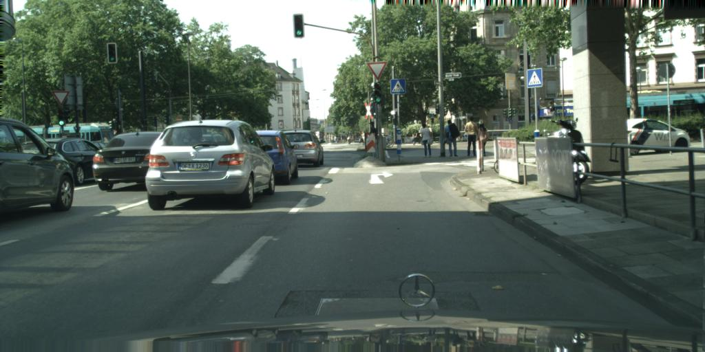
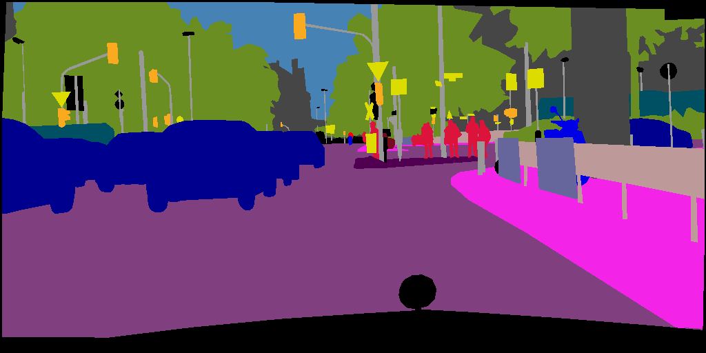
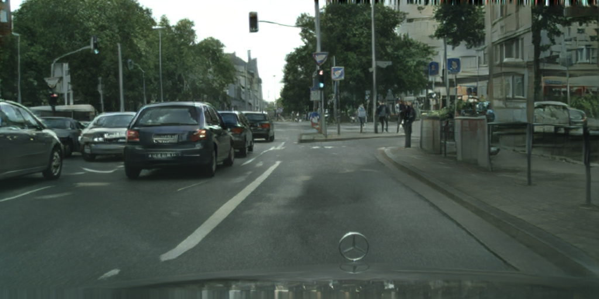
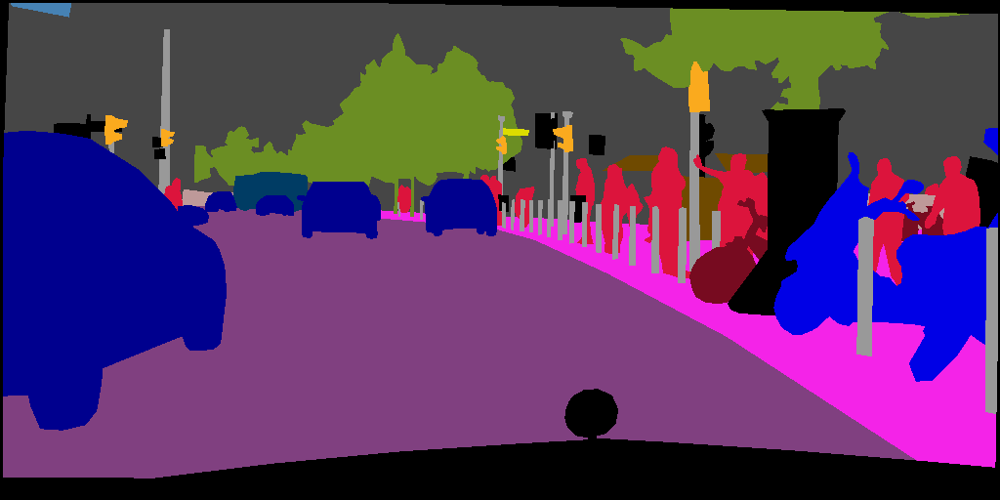
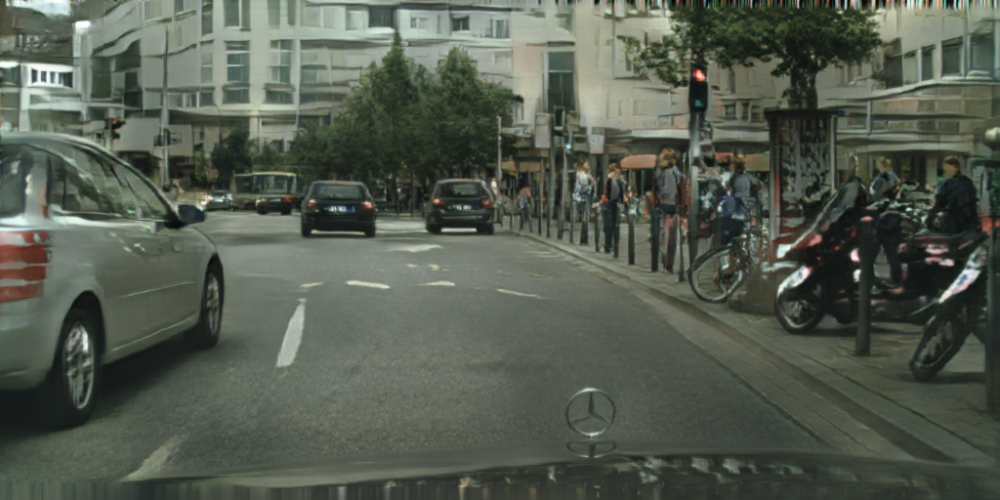

# pix2pixHD: High-Resolution Image Synthesis and Semantic Manipulation with Conditional GANs

###
[Project](https://tcwang0509.github.io/pix2pixHD/) |
[Paper](https://arxiv.org/pdf/1711.11585.pdf) |
[Video (5m)](https://youtu.be/3AIpPlzM_qs) |
[Previous Implementation](https://github.com/NVIDIA/pix2pixHD) |
[Two Minute Papers Video](https://youtu.be/XhH2Cc4thJw)


## License

Imaginaire is released under [NVIDIA Software license](LICENSE.md).
For commercial use, please consult [researchinquiries@nvidia.com](researchinquiries@nvidia.com)


## Software Installation
For installation, please checkout [INSTALL.md](../../INSTALL.md).

## Hardware Requirement
We trained our model using an NVIDIA DGX1 with 8 V100 16GB GPUs, which takes about 10 hours.

## Training

pix2pixHD prefers the following data structure.
```
${TRAINING_DATASET_ROOT_FOLDER}
└───images
    └───0001.jpg
    └───0002.jpg
    └───0003.jpg
    ...
└───seg_maps
    └───0001.png
    └───0002.png
    └───0003.png
    ...
└───instance_maps
    └───0001.png
    └───0002.png
    └───0003.png
    ...

### Training data preparation

- Download [the Cityscapes dataset](https://www.cityscapes-dataset.com/).
Extract images, segmentation masks, and object instance maks. Organize them
based on the above data structure. Please check out the original pix2pixHD repo
for converting the Cityscapes segmentation mask to a more compact format.

- Build the lmdbs
```bash
for f in train val; do
python scripts/build_lmdb.py \
--config configs/projects/pix2pixhd/cityscapes/ampO1.yaml \
--data_root dataset/cityscapes_raw/${f} \
--output_root dataset/cityscapes/${f} \
--overwrite
done
```

### Training command

```bash
python -m torch.distributed.launch --nproc_per_node=8 train.py \
--config configs/projects/pix2pixhd/cityscapes/ampO1.yaml
```

## Inference

pix2pixHD prefers the following file arrangement for testing.
```
${TEST_DATASET_ROOT_FOLDER}
└───seg_maps
    └───0001.png
    └───0002.png
    └───0003.png
    ...
└───instance_maps
    └───0001.png
    └───0002.png
    └───0003.png
    ...
    ...
```

- Download sample test data by running
```bash
python scripts/download_test_data.py --model_name pix2pixhd
```

```bash
python inference.py --single_gpu \
--config configs/projects/pix2pixhd/cityscapes/ampO1.yaml \
--output_dir projects/pix2pixhd/output/cityscapes
```

The results are stored in `projects/pix2pixhd/output/cityscapes`

Below we show the expected output images.


<table>
  <tr>
    <td>
        Ground truths
    </td>
    <td>
        Segmentation maps
    </td>
    <td>
        Synthesized results
    </td>
  </tr>
  <tr>
    <td>
    
    </td>
    <td>
    
    </td>
    <td>
    
    </td>
  </tr>
  <tr>
    <td>
    
    </td>
    <td>
    
    </td>
    <td>
    
    </td>
  </tr>
  <tr>
    <td>
    
    </td>
    <td>
    
    </td>
    <td>
    
    </td>
  </tr>
</table>

## Citation
If you use this code for your research, please cite our papers.

```
@inproceedings{wang2018pix2pixHD,
   title={High-Resolution Image Synthesis and Semantic Manipulation with Conditional GANs},
   author={Ting-Chun Wang and Ming-Yu Liu and Jun-Yan Zhu and Andrew Tao and Jan Kautz and Bryan Catanzaro},  
   booktitle={Proceedings of the IEEE Conference on Computer Vision and Pattern Recognition},
   year={2018}
}
```