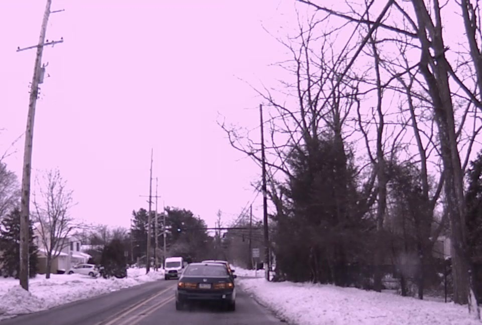
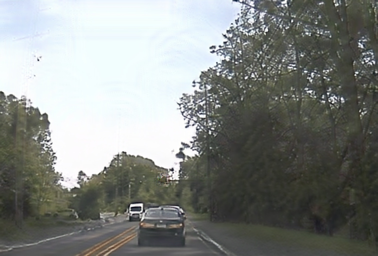
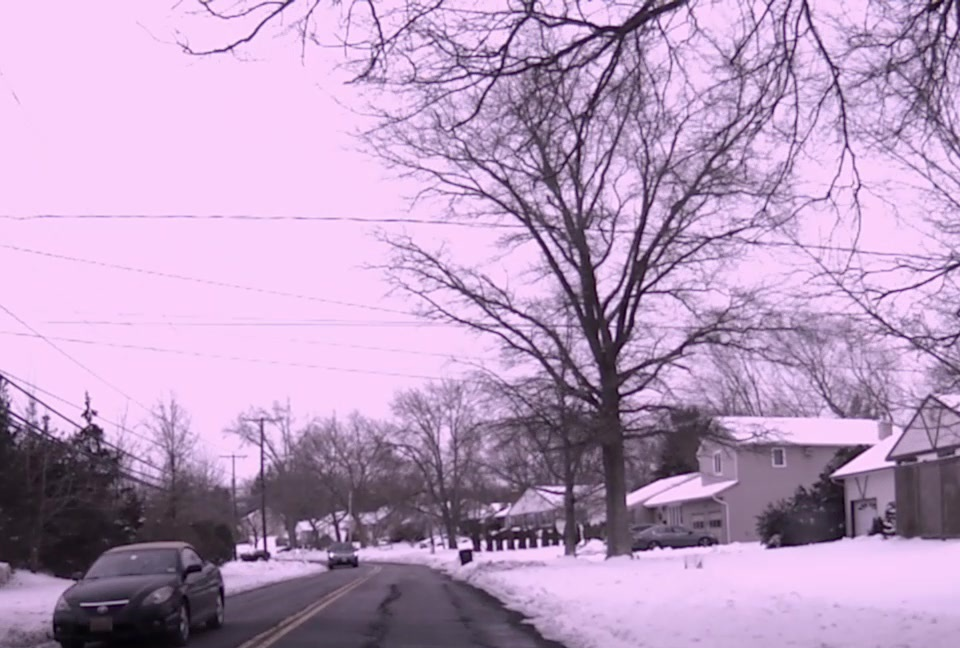
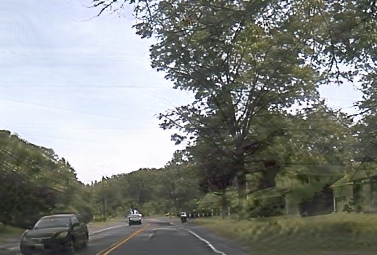
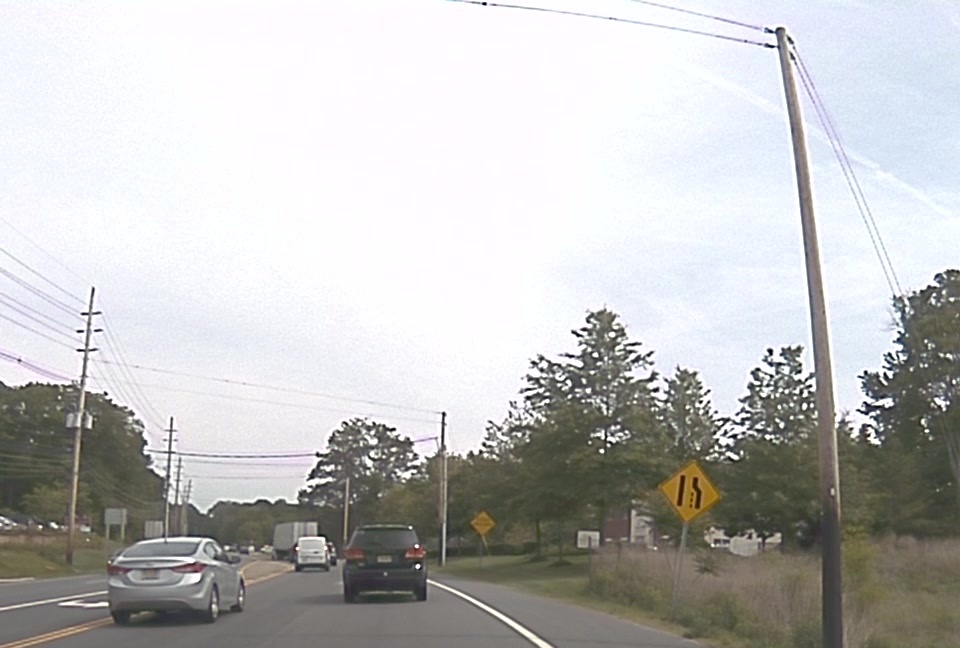
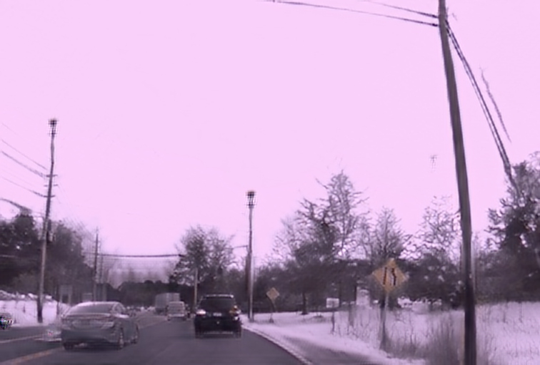
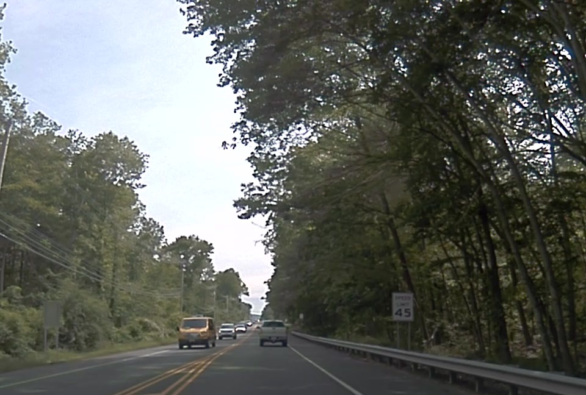
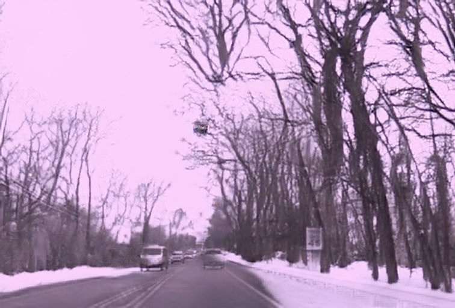

# UNIT: Unsupervised Image-to-Image Translation

###
[Paper](https://arxiv.org/abs/1703.00848) |
[Previous Implementation](https://github.com/mingyuliutw/UNIT) |
[Two Minute Papers Video](https://youtu.be/dqxqbvyOnMY)


This is an improved implementation of UNIT. The main differences are:
- Use spectral normalization in the generator and the discriminator.
- Use the two-timescale update rule (TTUR) with the discriminator learning rate 0.0004 and the generator learning rate 0.0001.
- Use hinge loss instead of least square loss.

## License

Imaginaire is released under [NVIDIA Software license](LICENSE.md).
For commercial use, please consult [researchinquiries@nvidia.com](researchinquiries@nvidia.com)

## Software Installation
For installation, please checkout [INSTALL.md](../../INSTALL.md).

## Hardware Requirement
We trained our models using an NVIDIA DGX1 with 8 V100 32GB GPUs. You can try to use fewer GPUs or reduce the batch size if it does not fit in your GPU memory, but training stability and image quality cannot be guaranteed.


## Inference
- Download a small set of test examples

```bash
python scripts/download_test_data.py --model_name unit
```

- Or arrange your own data into the following format.

```
projects/munit/test_data/summer2winter_test
└───images_a
    └───0001.jpg
    └───0002.jpg
    └───0003.jpg
    ...
└───images_b
    └───0001.jpg
    └───0002.jpg
    └───0003.jpg
    ...
```

### Translate images from winter to summer
- Inference command
```bash
python -m torch.distributed.launch --nproc_per_node=1 inference.py \
--config configs/projects/unit/winter2summer/base48_bs1.yaml \
--output_dir projects/unit/output/winter2summer
```
Outputs are saved in `projects/unit/output/winter2summer`:


<table>
  <tr>
    <td>
        Input
    </td>
    <td>
        Translation
    </td>
  </tr>
  <tr>
    <td>
    
    </td>
    <td>
    
    </td>
  </tr>
  <tr>
    <td>
    
    </td>
    <td>
    
    </td>
  </tr>
</table>

- To translate images in the other direction (from summer to winter), change
`a2b` to `False`.


<table>
  <tr>
    <td>
        Input
    </td>
    <td>
        Translation
    </td>
  </tr>
  <tr>
    <td>
    
    </td>
    <td>
    
    </td>
  </tr>
  <tr>
    <td>
    
    </td>
    <td>
    
    </td>
  </tr>
</table>


## Citation
If you use this code for your research, please cite our paper.

```
@inproceedings{liu2016unsupervised,
	title={Unsupervised Image-to-Image Translation Networks},
	author={Ming-Yu Liu and Thomas Breuel and Jan Kautz},
	booktitle={Conference on Neural Information Processing Systems (NeurIPS)}},
	year={2017}
}
```